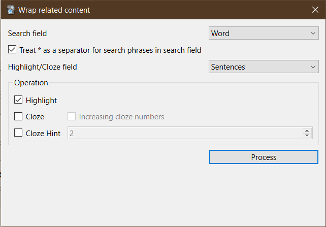

Anki add-on that provides a simple interface to search for a field's contents in another field
and do some wrapping operations on its occurences there.

## Credit

Icon from https://icons.getbootstrap.com
